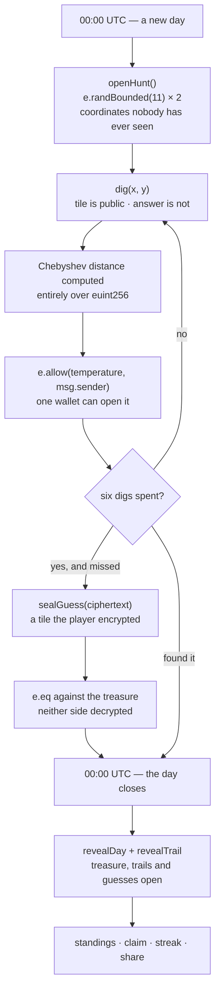
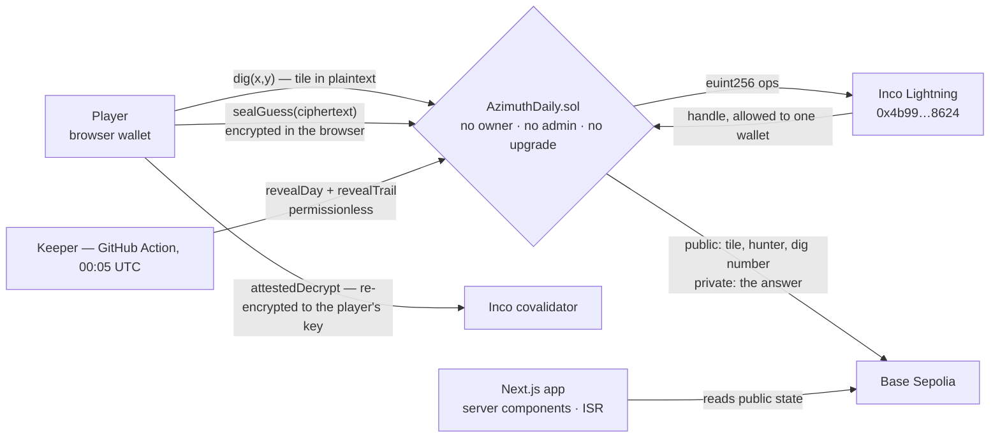

<div align="center">


# AZIMUTH


[](https://azimuth-inco.vercel.app)
[](https://base-sepolia.blockscout.com/address/0x86C59B978B14bc8B2914A70548baAB2700bd58d6?tab=contract)


### A daily treasure hunt where every move is public and **every clue is private.**

One treasure is buried on an 11×11 map. Everyone hunts the same one, on the same board, on the same day. You get six digs, and each one tells you only how close you are — in an answer **decrypted to your wallet and nobody else's**. You can watch exactly where your rivals dig, all day, and learn nothing from it. Run out of digs and you get **one sealed guess**: a tile you encrypt yourself, checked against a coordinate the contract cannot read either. At midnight UTC the map opens and the day is scored.

**[ Play it ↗ ](https://azimuth-inco.vercel.app)** · **[ Watch the demo ↗ ](https://github.com/user-attachments/assets/495164ae-be4f-4e80-b072-711b2020ee65)** · **[ Onchain evidence ↗ ](evidence/deployment.md)** · **[ Run it locally ↗ ](#run-it-locally)**

Built for the **Inco Summer Game Jam**, on **Inco Lightning** over Base Sepolia.

</div>

---

## Table of contents

- [The problem](#the-problem)
- [What Azimuth is](#what-azimuth-is)
- [Verify it yourself in 60 seconds](#verify-it-yourself-in-60-seconds)
- [How a hunt works](#how-a-hunt-works)
- [What is hidden, and what is not](#what-is-hidden-and-what-is-not)
- [The leak that shaped the contract](#the-leak-that-shaped-the-contract)
- [The sealed guess](#the-sealed-guess)
- [How Inco Lightning is used](#how-inco-lightning-is-used)
- [Architecture](#architecture)
- [Scoring, standings and streaks](#scoring-standings-and-streaks)
- [Sized by simulation, not by feel](#sized-by-simulation-not-by-feel)
- [Measured, not claimed](#measured-not-claimed)
- [The first rollover, end to end](#the-first-rollover-end-to-end)
- [What is real and what is seeded](#what-is-real-and-what-is-seeded)
- [Tech stack](#tech-stack)
- [Project layout](#project-layout)
- [Run it locally](#run-it-locally)
- [Tests](#tests)
- [Known limitations](#known-limitations)
- [Disclosure](#disclosure)

---

## The problem

A shared daily puzzle is only a game if nobody can read the answer. On a transparent chain, everybody can.

Put a treasure's coordinates in storage and one `eth_getStorageAt` ends the day for every player at once. Hash them and you have committed to a value you can no longer compute on — you cannot ask "how far is this tile from the answer" without revealing the answer. Keep them on a server and the whole thing is a web game with a wallet button: you are trusting an operator not to leak, not to play, and not to tell their friends.

That is why Wordle, Geoguessr, Hangman, Battleship and every guessing game like them have no honest onchain version. The genre needs a value that is **hidden from everyone including the operator, and still computable**.

## What Azimuth is

A daily hunt built on exactly that primitive. The treasure is generated encrypted, onchain, by the network — **no deployer key, no admin function, and no one anywhere holds the plaintext**. Each dig is a real transaction that runs a distance computation over ciphertext and hands back a temperature only the digging wallet can open.

<div align="center">

**`DIG → READ A CLUE ONLY YOU CAN SEE → NARROW THE MAP → SEAL A LAST GUESS → MIDNIGHT OPENS EVERYTHING`**

</div>

```
11 × 11 map  ·  6 digs  ·  1 sealed guess  ·  1 treasure  ·  everyone plays the same board

💎 FOUND     🔥 BURNING     🌡 HOT     🌤 WARM     ❄️ COLD     🥶 FREEZING
```

The contract has no owner, no pause, no admin and no upgrade path. `revealDay` is permissionless — if the scheduler this project runs disappears, anyone can open yesterday's map.

## Verify it yourself in 60 seconds

Every claim on this page is checkable from a terminal against the live deployment.

```bash
# The treasure for a live day is encrypted, and nobody is allowed to read it.
cast call 0x86C59B978B14bc8B2914A70548baAB2700bd58d6 \
  "treasureHandles(uint256)(bytes32,bytes32)" $(( $(date +%s) / 86400 )) \
  --rpc-url https://sepolia.base.org
# → two ciphertext handles. There is no view that returns a coordinate.

# Nothing public names a finder while the day runs.
cast call 0x86C59B978B14bc8B2914A70548baAB2700bd58d6 \
  "huntInfo(uint256)(uint64,uint32,uint32,bool,bool)" $(( $(date +%s) / 86400 )) \
  --rpc-url https://sepolia.base.org
# → openedAt, hunters, finders=0, opened, revealed=false
```

And the claim the whole project rests on — a rival cannot read your answer:

```bash
cd web && DEPLOYER_PRIVATE_KEY=0x... node scripts/prove-privacy.cjs
```

```
  PUBLIC — read from contract storage by anybody, with no key
  playerTrail(20679, 0xA69C2e36…)
  dig 1 of 1, tile (3,3)
  handle  0xa01bc2a143d6f6364fa9e597f586bf971c22ab3929f511b7c6deaa5477e90800

  WALLET A — 0xA69C2e36…, the wallet that dug it
  decrypt -> HOT

  WALLET B — 0x12af32D1…, a rival, same handle
  decrypt -> DENIED: Failed to decrypt handles
```

The rival wallet is generated fresh on every run and holds nothing, because reading someone else's answer is not a question of funds. The script refuses to run against a revealed day, where every trail is public on purpose and a successful read would prove nothing.

## How a hunt works



A dig takes about ten seconds, because the distance is being computed on encrypted numbers and then decrypted for one wallet. The interface narrates that as searching rather than hiding it.

## What is hidden, and what is not

Nothing here is encrypted for the sake of it. Each row exists because reading it early would end the game.

| Public while the hunt runs | Private while the hunt runs | Public after midnight |
|---|---|---|
| Which wallet dug | The treasure's coordinates | The treasure's coordinates |
| Which tile they dug | What each dig answered | Every trail and every answer |
| How many digs they have spent | Whether anyone has found it | Who found it, and in how many digs |
| That a hunter sealed a guess | Which tile they guessed, and whether it landed | Every sealed guess and its verdict |

The live board draws the left-hand column: rival digs appear as marks on your own map in real time. **You can follow every step somebody takes and learn nothing, because the step is public and the answer is not.** That gap is the entire game, and it is not a game you can build on a transparent chain.

## The leak that shaped the contract

This is the part worth reading, because getting it wrong is easy and silent.

Dig coordinates are **plaintext** — readable straight out of storage even without a view for them. An early version of this contract also emitted a public `TreasureFound` event and exposed a finished flag and a finder count.

Those two facts together gave the whole thing away: **the treasure is simply the finder's last dug tile.** One person finds it, anybody watching the chain knows where it is, and the day is ruined for everyone still playing. Encrypting the coordinate was not enough — the *metadata around a state transition* leaked it.

So scoring is deliberately delayed until the map opens. A player still sees their own result the instant they dig it, because their temperature is decrypted to their wallet and nowhere else. Only the public record waits. Three tests hold it shut:

- `testNothingPublicMarksAFinderWhileTheDayRuns`
- `testTheTreasureCannotBeClaimedBeforeMidnight`
- `testNothingPublicSaysWhetherAGuessLanded`

The rule held for a full day on chain: day 20678 ran with seven hunters, four of whom were holding a find — two had dug it up, two had named it — and `huntInfo` reported **0 finders** from the first dig until the moment the day closed.

## The sealed guess

Every dig is public the moment it lands, which is exactly what makes a last move worth hiding. When a hunter's six digs are gone they may name one more tile — and that one they encrypt themselves.

```solidity
euint256 tile  = e.newEuint256(tileCiphertext, msg.sender);      // the hunter's secret
ebool    right = e.eq(e.add(hunt.x, e.mul(hunt.y, FIELD)), tile); // against the contract's secret
e.allow(right, msg.sender);                                       // an answer only they can open
```

It is the only move on the board nobody can watch, and **the only ciphertext in Azimuth the contract did not mint itself**. Every other secret here is born inside `randBounded`; this one arrives from the player, and the two are compared without either side ever being decrypted.

The tile travels as one number, `x + 11 * y`, so a guess is a single ciphertext and a single equality. A right guess folds into the same flag a dug find sets, so settlement, scoring and the recap needed no new concepts at all.

## How Inco Lightning is used

| Mechanic | Call |
|---|---|
| A treasure nobody chooses | `e.randBounded(11)` for x and y |
| Distance to a secret | `e.max` / `e.min` / `e.sub` over `euint256`, never decrypted |
| Temperature ladder | `e.div(e.add(e.max(dx, dy), 1), 2)` — Chebyshev banded in twos |
| Answers only you can read | `e.allow(temperature, msg.sender)` |
| **A secret the player brings** | **`e.newEuint256(ciphertext, msg.sender)` for the sealed guess** |
| Comparing two secrets | `e.eq` over the guess and the treasure, both encrypted |
| Proving you found it | `e.verifyDecryption(found, true, covalidatorSignatures)` |
| Opening the map | `e.reveal` on the treasure, every trail and every guess, after midnight |
| Sponsored fees | the contract holds ETH and pays Inco's per-operation fee, so a player never sees one |

Both directions are covered: secrets the contract generates and never reveals, and secrets the player generates that the contract computes on without ever seeing.

## Architecture

Confidentiality is a property of the boundaries, not of the rendering.



The covalidator never returns plaintext over the wire: it re-encrypts each answer to the requesting wallet's session key, and the browser decrypts locally. A rival capturing that exact HTTP response byte for byte still learns nothing.

## Scoring, standings and streaks

Daily standings rank whoever dug the treasure up in fewest digs first, then anyone who found it with a sealed guess, then everyone who missed — ordered by how close they ever got, with earlier approaches breaking ties. A sealed find scores 73, in the gap the two ladders leave between the worst dug find (75, six digs) and the best possible miss (70, one tile away), and it never reports a dig count, because saying "found in six" would credit six digs that all missed.

The all-time table adds points across every day played, so turning up counts and not only winning: days played, treasures found, best find, best placing.

A **streak** is consecutive days you dug at least once — finding it is not required. It is derived entirely from chain history rather than stored anywhere, so there is nothing to fake and nothing to lose. An unplayed today does not break it: six days deep at 00:30 UTC you still have six, and the whole day to keep it.

Every standing is computed from **revealed data only**, so there is no path by which the leaderboard can leak a live day.

## Sized by simulation, not by feel

`contracts/sim/daily.mjs` runs the real temperature ladder against synthetic hunters before any of it was built.

```
configuration             careless player    thoughtful player
9×9,   6 digs, 5 temps     86% in 4 digs      85% in 4 digs      skill is irrelevant
11×11, 6 digs, 5 temps     83% in 5 digs      88% in 4 digs      locked
11×11, 6 digs, 6 temps     99% in 4 digs     100% in 4 digs      trivial
13×13, 6 digs, 5 temps     72% in 5 digs      74% in 5 digs      skill barely matters
```

A 9×9 map was rejected because careless and thoughtful play scored the same, which would have made a fewest-digs leaderboard rank luck. At 11×11 most people finish, and thinking shows up as four digs instead of five.

## Measured, not claimed

```
confidential answer, steady state      10–12 s
first answer on a fresh deployment     67–71 s   (the covalidator warming to a new contract)
sealed guess ciphertext                1316 bytes, encrypted in the browser
full hunt, six digs + a sealed guess   0.000016 ETH of gas
fee consumed on deploy                 2 × 10¹² wei, exactly two randBounded calls
```

A dig is not instant, and the interface makes the wait part of the tension rather than pretending it is not there.

## The first rollover, end to end

Day 20678 ran with seven hunters, closed at 00:00 UTC and opened at 00:11. Final standings, exactly as the recap renders them:

| Rank | Hunter | Result |
|---|---|---|
| 1 | kestrel | found it on dig 2 |
| 2 | brimstone | found it on dig 4 |
| 3 | corvid | six digs missed, sealed guess **K1 — right** |
| 4 | enoch | six digs missed, sealed guess **K1 — right** |
| 5 | enochox2 | six digs, closest one tile — BURNING on the last |
| 6 | quill | three digs, walked away |
| 7 | marlow | six digs missed, sealed guess A11 — wrong |

The find that settled exercised the whole confidential path — an encrypted flag, decrypted by its owner, proven to the contract without ever being exposed:

```
encrypted found flag decrypts to: true
SETTLED via verifyDecryption  tx 0x74c13c5f26cd06946fa305782e5e38afc31293934a8e4991a923ac82b458d919
day 20678: hunters=7 finders=1
```

The first sweep also exposed a real bug worth recording: the keeper skips a trail it can already read, and it was asking about only the first of a hunter's six ciphertexts. Reveals propagate unevenly — one trail came back with digs one and four public and the rest sealed — so that trail was marked done and would have stayed half shut permanently. The preflight now reads every handle a hunter left. Full write-up in [`evidence/deployment.md`](evidence/deployment.md).

## What is real and what is seeded

| Capability | Status |
|---|---|
| **Encrypted treasure, no plaintext anywhere** | Real. `e.randBounded` onchain; no owner, no admin, no key holds it. |
| **Per-wallet clue decryption** | Real. Verified by a two-wallet denial against the live contract, reproducible with one script. |
| **Player-encrypted sealed guess** | Real. Browser-side `encrypt`, `e.newEuint256`, homomorphic equality; three sealed on day 20678. |
| **Delayed settlement / no public winner** | Real. `finders` held at 0 for a whole day with four finds outstanding. Three tests. |
| **Midnight reveal + trail replay** | Real. Ran end to end on day 20678; recap, standings and leaderboard all render from revealed data. |
| **Claim by proving a decryption** | Real. `e.verifyDecryption` settled a find onchain — transaction above. |
| **Rival footprints** | Real. Public `Dug` data, drawn on the live board, temperatures structurally absent. |
| **Streaks, standings, share cards** | Real. Derived from chain history; nothing stored server-side. |
| **Contract source verification** | Real on Sourcify and Blockscout, creation and runtime both matching. BaseScan's own needs an Etherscan key this deployment does not carry. |
| Day 20678's hunters | Six of the seven were wallets we seeded so the first reveal had a populated board. Scripted hunts, not organic players. Their throwaway keys were discarded, so `finders` reads 1 rather than 4 — the standings derive from revealed trails, not claims, and are unaffected. |
| The keeper schedule | A GitHub Action at 00:05 UTC. Its cron slot is contended and has fired late; `revealDay` is permissionless precisely so this is never a single point of failure. |
| Anti-sybil | None. Digs are keyed on `msg.sender`, so the leaderboard is for fun, not for stakes. |
| Not built | Mainnet · prizes · multi-day tournaments · mobile app. |

## Tech stack

- **Contracts:** Solidity 0.8.29 · Foundry · [Inco Lightning](https://docs.inco.org) `euint256` / `ebool` · 272 lines in `AzimuthDaily.sol`, no dependencies beyond Inco.
- **Chain:** Base Sepolia (84532). The contract holds an ETH float and pays every Inco operation fee itself.
- **Web:** Next.js 16.3 (App Router, server components, ISR) · React 19.2 · TypeScript · Tailwind 4.
- **Chain client:** viem · wagmi · Reown AppKit · TanStack Query · `@inco/lightning-js` for encryption, attested decryption and reveal.
- **Keeper:** GitHub Actions cron → an authenticated route that opens yesterday's map, retries what it could not open, and answers 500 rather than reporting a red run green.
- **Testing:** Foundry against Inco's mock infrastructure (39) · Vitest over the pure game logic, standings, streaks, share safety and recap fallbacks (193).

## Project layout

```
contracts/
  src/AzimuthDaily.sol        # the game — randBounded, homomorphic distance, sealed guess, reveal
  src/AzimuthCallsigns.sol    # optional human-readable names
  src/test/                   # 39 Foundry tests, including the three leak tests
  sim/daily.mjs               # the simulation that chose 11×11 and six digs
  script/DeployDaily.s.sol    # deploy + fund the fee float + open the first hunt
web/
  src/app/                    # landing · /app · /app/recap · /app/leaderboard · api/reveal · api/drip
  src/lib/daily.ts            # the rules, shared by the board, the share card and the tests
  src/lib/standings.ts        # ranking and scoring, revealed data only
  src/lib/streak.ts           # progression derived from chain history
  src/lib/chain/              # contract client, recap loading, Inco wiring
  src/components/daily/       # the board, the Keeper, the sealed guess, the recap
  scripts/prove-privacy.cjs   # the two-wallet denial, runnable by anyone
  scripts/play-hunt.cjs       # play a full hunt from the command line
  scripts/verify-rollover.mjs # assert the chain and the recap agree after midnight
evidence/deployment.md        # transaction-level proof for every claim above
```

## Run it locally

Prerequisites: Node 20+, Foundry.

```bash
npm install                      # root: Foundry deps for contracts/

cd contracts
forge build
forge test                       # 39 tests
forge fmt --check

cd ../web
npm install
npm test                         # 193 tests
npm run lint
npm run build
npm run dev
```

Every command above passes from a clean clone with no extra flags.

`web/.env.local`:

```
NEXT_PUBLIC_REOWN_PROJECT_ID=...
NEXT_PUBLIC_DAILY_ADDRESS=0x86C59B978B14bc8B2914A70548baAB2700bd58d6
NEXT_PUBLIC_CALLSIGNS_ADDRESS=0x14EFc65668aFEAB2De1DfF8D8a88b8EE5F357f19
DEPLOYER_PRIVATE_KEY=...          # keeper and faucet only, never an owner key
CRON_SECRET=...                   # guards the reveal endpoint
```

Deploy your own:

```bash
cd contracts
DEPLOYER_PRIVATE_KEY=0x... forge script script/DeployDaily.s.sol:DeployDaily \
  --rpc-url https://sepolia.base.org --broadcast
```

Play a hunt without opening a browser:

```bash
cd web
node scripts/play-hunt.cjs --key 0x... --digs 3,4 7,7 0,10 --guess 5,5
```

## Tests

```bash
cd contracts && forge test     # 39 — the ladder, the six-dig limit, the sealed guess,
                               #      and three tests that hold the leak shut
cd web && npm test             # 193 — rules, standings, streaks, share-card safety,
                               #      recap fallbacks, failure copy, footprints
```

The suites are behaviour-first. The contract tests assert what an attacker can and cannot see at each point in a day, including that nothing public marks a finder mid-hunt and nothing public says whether a sealed guess landed. On the web side, the share card has its own leak guard: a sealed result is a **separate type** from a revealed one, with no field that could hold a coordinate, and a test walks the object to prove it.

## Known limitations

- **Six digs is about a minute of waiting.** Each confidential answer takes 10–12 seconds.
- **Nothing stops one person playing from several wallets.** The leaderboard is for fun, not for stakes.
- **A revealed day sometimes will not decrypt immediately.** The recap falls back to the most recent day the network will serve rather than showing an error.
- **The map opens on a schedule this project runs.** `revealDay` is permissionless, so anyone can open yesterday's map if the scheduler misses.

## Disclosure

Built during the Summer Game Jam window; the first commit is 11 August 2026, and the repository has 111 of them.

The history contains an earlier, larger game: 64×64 vaults, warmer/colder relative to your own best probe, purchasable compass bearings, an intel-licensing market. It works and its tests pass. The person who helped build it then looked at the finished screen and said *"I don't really understand this game."*

Relative feedback was the problem. `COLDER` means *further than your own closest probe so far*, which nobody can hold in their head across twenty moves. `HOT` means something on its own. That game was cut from `main` so this repository describes one product, and is preserved in full at the `pre-daily-pivot` tag and the `legacy-vault-game` branch.

```bash
git show pre-daily-pivot:contracts/src/AzimuthGame.sol
git checkout legacy-vault-game
```

<div align="center">


**The chain knows. You don't.**

</div>
